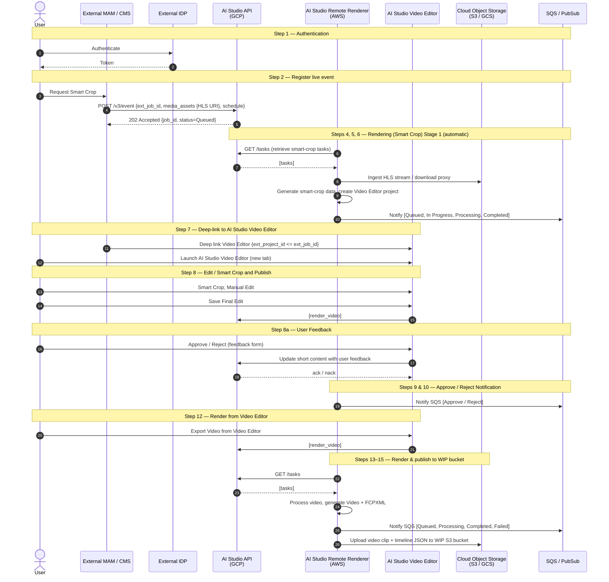

# Quickplay AI Studio Integration — Live Clipping Guide

This document describes the integration between an external **MAM / CMS** and the **Quickplay AI Studio** for the **Live Smart Crop** workflow — clipping live or scheduled streams identified by a source URL (HLS, HLS TS, or SRT depending on `output_format`) plus a schedule.

**See also:**
- [VOD Clipping Guide](ai_studio_vod_guide.md) — same workflow for pre-recorded assets (uses `/v3/upload`).
- [API reference](api_guide.md) — full endpoint, request/response, and schema documentation for the public API.

## 1. Overview

This integration enables an external Media Asset Management (MAM) / Content Management System (CMS) to:

1. Authenticate users against an external IdP.
2. Register a **single live / scheduled event** (source URL + one schedule) in AI Studio via `/v3/event`. `output_format` (default `VOD`) selects between a VOD asset (HLS input) and a reframed live stream (HLS TS or SRT input). Smart Crop processing runs **automatically** on the scheduled occurrence — no separate trigger call is required. Recurrence is not supported; each event registration represents one occurrence.
3. Deep-link users into the AI Studio Video Editor to review and edit.
4. Capture user feedback and approve/reject decisions.
5. Render and publish the final video **directly from the Video Editor** (Export) to a WIP cloud bucket.

Communication is bidirectional: the external system calls AI Studio **synchronous APIs**, and AI Studio reports progress **asynchronously** through a message queue (**SQS / PubSub**). `/v3/event` itself is **always asynchronous** — the API returns **202** with a `job_id` you poll via `/v2/status`.

## 2. Sequence Diagram



## 3. Components

| Participant | Hosting | Role |
|-------------|---------|------|
| **User** | — | Operator initiating Smart Crop / edit requests |
| **External MAM / CMS** | External | Source of the HLS source URL and orchestrator of API calls |
| **External IDP** | External | User authentication |
| **AI Studio API** | GCP | Public API surface (event registration, status, moments search) |
| **AI Studio Remote Renderer** | AWS | Worker that pulls tasks and performs rendering |
| **AI Studio Video Editor** | GCP / AWS | Browser-based timeline editor (deep-linked) |
| **Cloud Object Storage** | S3 / GCS | WIP render output |
| **SQS / PubSub** | AWS / GCP | Asynchronous status and progress notifications |

### Cloud / analytics deployment variants

The platform supports multiple deployment combinations:

| Cloud | Analytics | Notes |
|-------|-----------|-------|
| GCP | GCS + Gemini | Analytics enabled |
| AWS | S3 + TwelveLabs | Analytics enabled |
| GCP | GCS + No Analytics + Dolby | Analytics disabled |
| AWS | S3 + No Analytics + Dolby | Analytics disabled |

- **Analytics Enabled:** Metadata details **and** Smart Crop progress are sent to SQS / PubSub.
- **Analytics Disabled:** Only Smart Crop progress is sent to SQS / PubSub.

## 4. Key Identifiers

| Identifier | Description |
|------------|-------------|
| `ext_job_id` | External Job ID supplied by the MAM/CMS on `/v3/event`; also used as the External Project ID for the Video Editor. |
| `ext_asset_id` | External ID of the HLS media asset supplied on `/v3/event.media_assets`. |
| `ext_event_id` | External ID of the event's schedule (supplied inside `/v3/event.schedule`). Required. |
| `job_id` | Quickplay-internal job identifier (UUID) returned by `/v3/event`. Poll it via `/v2/status`. |
| `media_id` | Quickplay-internal asset identifier (UUID) assigned to the event. Usable in `/moments/search`. |
| `ext_project_id` | Video Editor project ID; derived from `ext_job_id` (`ext_project_id <= ext_job_id`). |

## 5. End-to-End Flow

### Step 1 — Authentication
The user authenticates through the **External IDP** to access the Video Editor. **Server-to-server API calls** to AI Studio are authenticated separately with an **API key** passed in the `x-api-key` header (scheme `ApiKeyAuth`). All endpoints below require it.

### Step 2 — Register the live / scheduled event
The event is identified by a **source URL** plus a **single schedule** (start/end). Each POST registers **one** event occurrence — **recurrence is not supported**. `output_format` selects the delivered output type:

- `output_format: VOD` *(default)* — output is a VOD asset. Input `media_assets.uri` must be **HLS** (`.m3u8`).
- `output_format: Live` — output is a **live stream reframed** per the `REFRAME_*` flags in `ai_flags`. Input `media_assets.uri` may be **HLS TS** (`.m3u8`, MPEG-TS segments) or **SRT** (`srt://…`).

Processing is **always asynchronous** — the API returns **202** with a `job_id`:

```
POST /v3/event
{
  "ext_job_id": "event-group-002",
  "output_format": "VOD",
  "media_assets": {
    "ext_asset_id": "live-event-002",
    "uri": "https://example.com/live/event-002/master.m3u8"
  },
  "schedule": {
    "ext_event_id": "event-002-occurrence",
    "start": { "date_time": "2026-06-15T19:00:00Z" },
    "end":   { "date_time": "2026-06-15T21:00:00Z" },
    "metadata": [ { "language": "en-US", "title": "Weekly Show" } ]
  },
  "priority": 500,
  "email": "producer@example.com",
  "ai_flags": [ "GENERATE_METADATA", "DETECT_SCENES" ]
}
=> 202 Accepted { "job_id", "status": "Queued" }
```

**Live output example (reframed, SRT input):**

```
POST /v3/event
{
  "ext_job_id": "event-group-003",
  "output_format": "Live",
  "media_assets": {
    "ext_asset_id": "live-event-003",
    "uri": "srt://ingest.example.com:9000?streamid=event-003"
  },
  "schedule": {
    "ext_event_id": "event-003-occurrence",
    "start": { "date_time": "2026-06-15T19:00:00Z" },
    "end":   { "date_time": "2026-06-15T21:00:00Z" }
  },
  "priority": 500,
  "email": "producer@example.com",
  "ai_flags": [ "REFRAME_9_16", "REFRAME_1_1" ]
}
```

> `schedule` carries its own `ext_event_id` and optional `metadata`. `date_time` must encode UTC (`Z`) or an explicit offset — there's no separate `timeZone` field.
>
> `ai_flags` accepts any non-empty subset of `{GENERATE_METADATA, DETECT_SCENES, REFRAME_9_16, REFRAME_1_1, REFRAME_3_4}` (values must be unique). Since `/v3/event` is already asynchronous, `ai_flags` selects **what** AI processing runs, not whether the request is async. When `output_format = Live`, the `REFRAME_*` flags drive the live reframe.

Poll `/v2/status` with the returned `job_id` (or `ext_job_id`) until it reaches `Completed`. Smart Crop processing then runs **automatically** on the scheduled occurrence — the CMS does **not** need to make an explicit trigger call.

### Steps 4, 5, 6 — AI Studio Rendering (Smart Crop) Stage 1 (automatic)

1. The **AI Studio Remote Renderer** polls the API and **retrieves Smart-Crop tasks** (`/tasks` → `[tasks]`) generated automatically for the scheduled occurrence.
2. It **ingests the HLS stream** (or downloads the proxy for the scheduled window), generates **smart-crop data**, and **creates the Video Editor project**.
3. A notification is published to the **SQS / PubSub** queue with:
   - `Job ID` — Quickplay-internal job id
   - `External Job ID` — external job id (also the External Project ID of the Video Editor)
   - `Status` — one of `Queued`, `Processing`, `Completed`, `Failed`

   Progress notifications observed: `Queued`, `In Progress`, `Processing`, `Completed`.

### Step 7 — Deep-link to AI Studio from External CMS / MAM
Once event registration is successful, the external MAM/CMS **deep-links** into the AI Studio Video Editor using the Project ID.

- The Video Editor launches in a **new browser tab** with the videos **automatically added to the timeline** (using the start/end time).
- Link mapping: `ext_project_id <= ext_job_id`.

```
Deep Link: AI Studio Video Editor  { ext_project_id <= ext_job_id }
```

### Step 8 — Edit / Smart Crop and Publish
In the Video Editor the user can:
- Perform Smart Crop or make further manual edits.
- Save the final edit.
- Click **Publish** to publish to the predefined **WIP destination**.

The editor issues a `[render_video]` request to the AI Studio API.

### Step 8a — User Feedback
Once editing is complete, the user is prompted with a **feedback form**. The captured feedback is used for **subsequent model training**.

- The user submits an **Approve / Reject** decision.
- The short content is updated with the user feedback (`Update Short Content with the user feedback` → `ack / nack`).

### Steps 9 & 10 — Approve / Reject Notification
The **AI Studio Remote Renderer** receives the approval / rejection task and forwards it to **SQS / PubSub**.

```
Notify SQS [ Approve / Reject ]
```

### Step 12 — Render Video from Video Editor
The user renders the video **directly from the Video Editor** by clicking the **Export** button (`Export Video from Video Editor` → `[render_video]`). This is the only render path for the live flow — there is no API-driven publish endpoint.

### Steps 13–15 — AI Studio Rendering and Publishing to S3 Bucket
1. The **AI Studio Remote Renderer** pulls the task (`/tasks` → `[tasks]`).
2. It processes the video and **publishes the final Video and FCPXML** to the **WIP S3 Bucket**.
3. A notification is published to **SQS / PubSub** with:
   - `Project ID` — sent while launching the project
   - `Job ID` — Quickplay-internal job id
   - `Status` — one of `Queued`, `Processing`, `Completed`, `Failed`
4. The video clip + timeline JSON is uploaded to the **WIP S3 bucket**.

```
Notify SQS [ Queued, Processing, Completed, Failed ]
Upload Video Clip + Timeline JSON -> WIP S3 Bucket
```

## 6. API Reference

**Spec:** AI Studio Public API `v6.3.3` (OpenAPI 3.0.3)
**Base URL:** `https://sandbox.cloud.quickplay.com/genai-api`
**Auth:** API key in the `x-api-key` header (`ApiKeyAuth`) — required on every endpoint.

### 6.1 Endpoint summary (Live flow)

| Method | Endpoint | Purpose | Success |
|--------|----------|---------|---------|
| POST | `/v3/event` | Register a live / scheduled event (HLS) for ingestion + AI processing | `202` (`job_id`) |
| PUT | `/v3/event/{ext_job_id}` | Edit an existing event's `schedule`, `priority`, `email`, or `ai_flags` | `202` (`job_id`) · `404` not found |
| DELETE | `/v3/job/{ext_job_id}` | Delete an existing job (event or smart-crop) and cancel pending processing | `204` no content · `404` not found |
| POST | `/v2/status` | Poll status of one or more jobs (by `job_id` **or** `ext_job_id`) | `200` (`JobStatus[]`) |
| POST | `/moments/search` | Search uploaded media for AI-curated moments by natural-language prompt | `200` (ranked moments) |

All endpoints return `400` (invalid/expired API key), `401` (missing API key / unauthorized), and `403` (permission denied) on failure.

> For pre-recorded (VOD) mezzanine assets, see [`/v3/upload`](ai_studio_vod_guide.md) in the VOD Clipping Guide.

### 6.2 `POST /v3/event` — Live / scheduled event registration

Registers a **single** event identified by a source URL plus a single schedule (start/end). **Recurrence is not supported** — each POST registers one occurrence. `output_format` (default `VOD`) selects the delivered output type and constrains the accepted input protocol:

| `output_format` | Output | Accepted `media_assets.uri` |
|-----------------|--------|-----------------------------|
| `VOD` *(default)* | VOD asset | HLS only (`https://…/master.m3u8`) |
| `Live` | Reframed live stream (per `REFRAME_*` flags in `ai_flags`) | HLS TS (`https://…/master.m3u8`, MPEG-TS segments) or SRT (`srt://…`) |

Processed asynchronously:

```
POST /v3/event
{
  "ext_job_id": "event-group-001",
  "media_assets": { "ext_asset_id": "live-event-001", "uri": "https://example.com/live/event-001/master.m3u8" },
  "schedule": {
    "ext_event_id": "event-001-occurrence",
    "start": { "date_time": "2026-06-15T19:00:00Z" },
    "end":   { "date_time": "2026-06-15T21:00:00Z" }
  },
  "priority": 500,
  "email": "producer@example.com",
  "ai_flags": [ "GENERATE_METADATA", "DETECT_SCENES" ]
}
=> 202 Accepted { "job_id", "status": "Queued" }
```

**Schedule shape.** `schedule` requires:

- `ext_event_id` — external identifier for this scheduled occurrence.
- `start.date_time`, `end.date_time` — ISO-8601 timestamps; must encode UTC (`Z`) or an explicit offset. There is no separate `timeZone` field.
- `metadata[]` *(optional)* — array of per-language `{ language, title, description, ... }` blocks.

### 6.3 `PUT /v3/event/{ext_job_id}` — Edit an existing event

Updates an already-registered event. Only `schedule`, `priority`, `email`, and `ai_flags` are editable — the identity fields (`ext_job_id`, `media_assets`) are **immutable**. `email` is **required** on every update, and at least one of `schedule`, `priority`, or `ai_flags` must also be supplied. Any omitted field is left unchanged. Processing is asynchronous (same as `POST /v3/event`):

```
PUT /v3/event/event-group-002
{
  "email": "producer@example.com",            // required
  "schedule": {                               // conditional — full replacement of the existing schedule
    "ext_event_id": "event-002-occurrence-rescheduled",
    "start": { "date_time": "2026-06-22T19:00:00Z" },
    "end":   { "date_time": "2026-06-22T21:00:00Z" }
  },
  "priority": 800,                            // conditional
  "ai_flags": [ "GENERATE_METADATA", "REFRAME_9_16" ]   // conditional
}
=> 202 Accepted { "job_id", "status": "Queued" }
=> 400 if email is missing, or no schedule/priority/ai_flags supplied
=> 404 if no event exists for ext_job_id
```

> **`schedule` is a full replacement, not a merge.** Supplying `schedule` replaces the existing schedule object entirely.

### 6.4 `DELETE /v3/job/{ext_job_id}` — Delete a job

Deletes an existing job. Works for jobs created via **either** `POST /v3/event` (event registration) **or** `POST /v3/smart-crop` (smart-crop job). Removes the job and cancels any **pending** processing associated with the given `ext_job_id`. Any downstream artifacts already produced (e.g. published renders) are unaffected. `email` is **required** in the request body (identifies the requesting user for audit purposes).

```
DELETE /v3/job/event-group-002
{
  "email": "producer@example.com"
}
=> 204 No Content
=> 400 if email is missing
=> 404 if no job exists for ext_job_id
```

### 6.5 `POST /v2/status` — Job status polling

Poll `/v2/status` after `/v3/event` (asynchronous). Submit either a list of `job_id`s or a list of `ext_job_id`s (mutually exclusive):

```
POST /v2/status
{ "job_id": [ "1015825c-7c90-4042-8513-24585fb9c235" ] }
   — or —
{ "ext_job_id": [ "event-group-002" ] }

=> 200 [
  {
    "job_id": "...", "ext_job_id": "...",
    "status": "Queued | Processing | Completed | Failed",
    "progress_percent": 0-100,
    "media_assets": [ { "uri": "s3://.../file.mp4", "asset_type": "video" } ],  // when Completed
    "error": { "code": 400342, "message": "Invalid Event" }                      // when Failed
  }
]
```

### 6.6 `POST /moments/search` — AI moments search

Searches previously registered media (including events) for moments matching natural-language prompts. Scope is optional — supply **either** `external_id[]` **or** `media_id[]` (mutually exclusive); omit both to search all media accessible to the API key:

```
POST /moments/search
{
  "prompts": [ "Verstappen winning the Japanese GP" ],
  "external_id": [ "event-group-002" ]        // optional; or "media_id": ["<uuid>"]
}
=> 200 [
  {
    "start": 387, "end": 457,                       // seconds within source media
    "media_id": "db708bc2-...", "media_external_id": "...",
    "confidence_score": 0.58, "rank": 1,
    "preview_uri": "https://.../frame.jpeg",
    "title": "Max Verstappen's Dominant Japanese GP Victory",
    "hashtags": "#F1,#JapaneseGP,#MaxVerstappen",
    "relevance_reason": "..."
  }
]
```

## 7. Job Status & Asynchronous Notifications

There are two complementary status channels:

1. **Polling — `POST /v2/status` (external-facing, supported by the public API).** The external MAM/CMS tracks any `job_id`/`ext_job_id` it received from `/v3/event`. Status values: `Queued`, `Processing`, `Completed` (includes output `media_assets[]`), `Failed` (includes `error`). See §6.5.

2. **SQS / PubSub notifications (internal renderer → platform, per the diagram).** The AI Studio Remote Renderer publishes lifecycle and progress events (`Queued`, `In Progress`, `Processing`, `Completed`, `Failed`, and `Approve`/`Reject` on the feedback path) carrying `Job ID`, `External Job ID` / `Project ID`, and `Status`. Whether this queue is exposed to the external system is an open question (see §9).

## 8. Additional Info & Constraints

- **Automatic Smart Crop:** Smart Crop jobs are generated **automatically** for the scheduled occurrence once the event is registered — the CMS does not call `/v2/smart-crop` explicitly. The auto-generated job is keyed on the event's `ext_job_id`.
- **Always async:** `/v3/event` always returns `202` + `job_id`; poll `/v2/status` to observe registration completion.
- **Source URL:** the `media_assets.uri` scheme depends on `output_format`. `VOD` (default) accepts HLS (`.m3u8`) only; `Live` accepts HLS TS or SRT (`srt://…`).
- **Output format:** `output_format` (default `VOD`) selects VOD asset output vs a reframed live stream. `Live` output requires one or more `REFRAME_*` flags in `ai_flags` to drive the reframing.
- **Single occurrence per event:** each `/v3/event` POST registers **one** event (one `schedule` object). Recurring events are not supported — POST a new event for each occurrence.
- **Priority:** `priority` (0–1000, default 0) orders processing; within the same priority, earlier requests win.
- **Render path:** rendering the final video is triggered **only** from the Video Editor (Export). There is no API-driven publish endpoint for live events.
- **Deep-link contract:** the Video Editor project is keyed off `ext_job_id` (`ext_project_id <= ext_job_id`), so the external system can correlate the editor session back to its own job.
- **Feedback loop:** Approve/Reject feedback is captured for model training.

## 9. Open Questions

The diagram flags the following items as open (marked `Q8`–`Q11` and the cloud/analytics matrix) for confirmation with the Quickplay team:

- **Q8 / Q9:** Confirm behavior of the Export-from-editor render path (queue events, retries).
- **Q10 / Q11:** Confirm the exact SQS / PubSub payload schema for the render-complete and WIP-upload notifications.
- Confirm the analytics-enabled vs. analytics-disabled payload differences per cloud (GCS + Gemini, S3 + TwelveLabs, Dolby variants).

---

*Sources: `Plan.drawio` (Quickplay AI Studio Integration sequence diagram) and `ais_api_v6.3.3.yml` (AI Studio Public API spec v6.3.3).*
