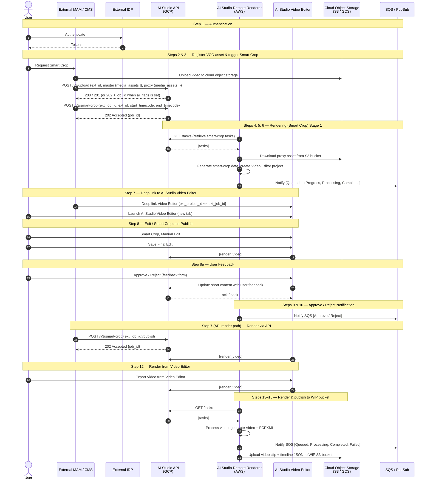

# Quickplay AI Studio Integration — VOD Clipping Guide

This document describes the integration between an external **MAM / CMS** and the **Quickplay AI Studio** for the **VOD Smart Crop** workflow — clipping pre-recorded (video-on-demand) mezzanine assets.

**See also:**
- [Live Clipping Guide](ai_studio_live_guide.md) — same workflow for live / scheduled HLS events (uses `/v3/event`).
- [API reference](api_guide.md) — full endpoint, request/response, and schema documentation for the public API.

## 1. Overview

This integration enables an external Media Asset Management (MAM) / Content Management System (CMS) to:

1. Authenticate users against an external IdP.
2. Register **VOD source and proxy media assets** in AI Studio via `/v3/upload`.
3. Trigger Smart Crop processing on registered assets.
4. Deep-link users into the AI Studio Video Editor to review and edit.
5. Capture user feedback and approve/reject decisions.
6. Render and publish the final video (either via API or directly from the editor) to a WIP cloud bucket.

Communication is bidirectional: the external system calls AI Studio **synchronous APIs**, and AI Studio reports progress **asynchronously** through a message queue (**SQS / PubSub**).

## 2. Sequence Diagram



## 3. Components

| Participant | Hosting | Role |
|-------------|---------|------|
| **User** | — | Operator initiating Smart Crop / edit requests |
| **External MAM / CMS** | External | Source of assets and orchestrator of API calls |
| **External IDP** | External | User authentication |
| **AI Studio API** | GCP | Public API surface (upload, smart-crop, publish) |
| **AI Studio Remote Renderer** | AWS | Worker that pulls tasks and performs rendering |
| **AI Studio Video Editor** | GCP / AWS | Browser-based timeline editor (deep-linked) |
| **Cloud Object Storage** | S3 / GCS | Source proxy assets and WIP render output |
| **SQS / PubSub** | AWS / GCP | Asynchronous status and progress notifications |

### Cloud / analytics deployment variants

The platform supports multiple deployment combinations:

| Cloud | Analytics | Notes |
|-------|-----------|-------|
| GCP | GCS + Gemini | Analytics enabled |
| AWS | S3 + TwelveLabs | Analytics enabled |
| GCP | GCS + No Analytics + Dolby | Analytics disabled |
| AWS | S3 + No Analytics + Dolby | Analytics disabled |

- **Analytics Enabled:** Metadata details **and** Smart Crop progress are sent to SQS / PubSub.
- **Analytics Disabled:** Only Smart Crop progress is sent to SQS / PubSub.

## 4. Key Identifiers

| Identifier | Description |
|------------|-------------|
| `ext_id` | External ID of an **asset group** in the MAM/DAM. Supplied at upload time on `master`/`proxy`. Smart Crop references the **master group** `ext_id`. |
| `ext_asset_id` | External ID of an individual media asset (video/audio/cc track) within an upload group. |
| `media_id` | Quickplay-internal asset identifier (UUID) assigned at upload. Returned by `/v3/upload` and usable in `/moments/search`. |
| `ext_job_id` | External Job ID supplied by the MAM/CMS on `/v3/smart-crop`; also used as the External Project ID for the Video Editor. |
| `job_id` | Quickplay-internal job identifier (UUID) returned by upload (async), smart-crop, and publish endpoints. Poll it via `/v2/status`. |
| `ext_project_id` | Video Editor project ID; derived from `ext_job_id` (`ext_project_id <= ext_job_id`). |

## 5. End-to-End Flow

### Step 1 — Authentication
The user authenticates through the **External IDP** to access the Video Editor. **Server-to-server API calls** to AI Studio are authenticated separately with an **API key** passed in the `x-api-key` header (scheme `ApiKeyAuth`). All endpoints below require it.

### Steps 2 & 3 — Register VOD Asset and Trigger Smart Crop
When the user requests a Smart Crop, the external CMS/MAM must **register the source and proxy media assets** via the Upload API **before** the Smart Crop request.

- The video is uploaded to **Cloud Object Storage** (S3 / GCS).
- The asset is registered via the Upload API.

**Register asset** — a single upload registers a `master` group (required) and an optional `proxy` group, each wrapping a `media_assets[]` array (so multi-track / multi-rendition deliveries register together):
```
POST /v3/upload
{
  "master": {
    "ext_id": "asset-group-001",
    "media_assets": [
      {
        "ext_asset_id": "master-video-001",
        "uri": "s3://bucket/media/video.mxf",   // schemes: https, s3, gcs
        "duration": 120.5,
        "size": 7516192768,
        "media_profile": [ { "group_type": "video", "track_info": { ... } } ]
      }
    ]
  },
  "proxy": { "ext_id": "asset-group-001-proxy", "media_assets": [ ... ] },
  "priority": 500,                  // 0 (lowest) – 1000 (highest), default 0
  "email": "producer@example.com",
  "ai_flags": [ "GENERATE_METADATA", "DETECT_SCENES" ],
  "metadata": [ { "language": "en-US", "title": "...", "description": "..." } ]
}
=> 201 Created  (or 200 if the group already exists)        // UploadResponse
=> 202 Accepted { "job_id", "status": "Queued" }            // when ai_flags is set (async)
```

> **Note:** If the asset is already registered, AI Studio returns **200** with the existing asset info rather than failing — the endpoint is effectively **idempotent**. When `ai_flags` is supplied the upload is processed asynchronously (**202**); poll `/v2/status` with the returned `job_id`.
>
> `ai_flags` accepts any non-empty subset of `{GENERATE_METADATA, DETECT_SCENES, REFRAME_9_16, REFRAME_1_1, REFRAME_3_4}` (values must be unique).

**Trigger Smart Crop.** The request takes a **sequence** of clips referencing the **master group** `ext_id` with in/out timecodes. Assets can be **pre-registered** (via a prior `/v3/upload` call) or **registered inline** using the optional `media_assets` array (each item has the same shape as a `/v3/upload` `master.media_assets[]` entry):

```
POST /v3/smart-crop
{
  "ext_job_id": "ext-job-001",            // links to Video Editor Project ID
  "email": "producer@example.com",        // required
  "sequence": [
    {
      "ext_id": "asset-group-001",         // master group ext_id previously registered via /v3/upload
      "start_timecode": "00:00:10:00",
      "end_timecode": "00:00:25:00"
    }
  ],
  "media_assets": [                        // optional — omit if assets were pre-registered via /v3/upload
    { "ext_asset_id": "master-video-001", "uri": "http://<HLS URL>", "duration": 120.5, "size": 7516192768 }
  ],
  "export_template_name": [ "HD-1080p-Stereo" ],   // optional
  "priority": 500
}
=> 202 Accepted { "job_id": "<quickplay internal job id>" }
```

> **`media_profile` is optional** on both `/v3/upload` and inside inline `media_assets[]` here — when omitted, the profile is inferred from the asset.

### Steps 4, 5, 6 — AI Studio Rendering (Smart Crop) Stage 1
1. The **AI Studio Remote Renderer** polls the API and **retrieves Smart-Crop tasks** (`/tasks` → `[tasks]`).
2. It **downloads the proxy asset** from the S3 bucket, generates **smart-crop data**, and **creates the Video Editor project**.
3. A notification is published to the **SQS / PubSub** queue with:
   - `Job ID` — Quickplay-internal job id
   - `External Job ID` — external job id (also the External Project ID of the Video Editor)
   - `Status` — one of `Queued`, `Processing`, `Completed`, `Failed`

   Progress notifications observed: `Queued`, `In Progress`, `Processing`, `Completed`.

### Step 7 — Deep-link to AI Studio from External CMS / MAM
Once asset registration is successful, the external MAM/CMS **deep-links** into the AI Studio Video Editor using the Project ID and the external source IDs.

- The Video Editor launches in a **new browser tab** with the videos **automatically added to the timeline** (using the start/end time).
- Link mapping: `ext_project_id <= ext_job_id`.

```
Deep Link: AI Studio Video Editor  { ext_project_id <= ext_job_id }
```

### Step 8 — Edit / Smart Crop and Publish
In the Video Editor the user can:
- Perform Smart Crop or make further manual edits.
- Save the final edit.
- Click **Publish** to publish to the predefined **WIP destination**.

The editor issues a `[render_video]` request to the AI Studio API.

### Step 8a — User Feedback
Once editing is complete, the user is prompted with a **feedback form**. The captured feedback is used for **subsequent model training**.

- The user submits an **Approve / Reject** decision.
- The short content is updated with the user feedback (`Update Short Content with the user feedback` → `ack / nack`).

### Steps 9 & 10 — Approve / Reject Notification
The **AI Studio Remote Renderer** receives the approval / rejection task and forwards it to **SQS / PubSub**.

```
Notify SQS [ Approve / Reject ]
```

### Step 7 (API render path) — External MAM Renders the Video via API
As an alternative to editing in the browser, the external MAM/CMS can render and publish an existing smart-crop job directly via API. The job referenced by `ext_job_id` must have been created via `/v3/smart-crop`. The video is rendered **once per export template**:

```
POST /v3/smart-crop/{ext_job_id}/publish
{
  "export_template_name": [ "HD-1080p-Stereo", "Proxy-720p" ],   // required, >= 1
  "priority": 500,
  "email": "producer@example.com"
}
=> 202 Accepted { "job_id": "<quickplay internal job id>" }
=> 404 if no smart-crop job exists for ext_job_id
```

This renders and publishes the video to the S3 / GCS bucket.

### Step 12 — Render Video from Video Editor
Alternatively, the user can render the video **directly from the Video Editor** by clicking the **Export** button (`Export Video from Video Editor` → `[render_video]`).

### Steps 13–15 — AI Studio Rendering and Publishing to S3 Bucket
1. The **AI Studio Remote Renderer** pulls the task (`/tasks` → `[tasks]`).
2. It processes the video and **publishes the final Video and FCPXML** to the **WIP S3 Bucket**.
3. A notification is published to **SQS / PubSub** with:
   - `Project ID` — sent while launching the project
   - `Job ID` — Quickplay-internal job id
   - `Status` — one of `Queued`, `Processing`, `Completed`, `Failed`
4. The video clip + timeline JSON is uploaded to the **WIP S3 bucket**.

```
Notify SQS [ Queued, Processing, Completed, Failed ]
Upload Video Clip + Timeline JSON -> WIP S3 Bucket
```

## 6. API Reference

**Spec:** AI Studio Public API `v6.3.3` (OpenAPI 3.0.3)
**Base URL:** `https://sandbox.cloud.quickplay.com/genai-api`
**Auth:** API key in the `x-api-key` header (`ApiKeyAuth`) — required on every endpoint.

### 6.1 Endpoint summary (VOD flow)

| Method | Endpoint | Purpose | Success |
|--------|----------|---------|---------|
| POST | `/v3/upload` | Register master/proxy asset group(s), optionally with AI processing flags | `200` exists · `201` created · `202` async (`job_id`) |
| POST | `/v3/smart-crop` | Generate video from a sequence of assets (registered via `/v3/upload` or inline via `media_assets`) | `202` (`job_id`) |
| POST | `/v3/smart-crop/{ext_job_id}/publish` | Render & export an existing smart-crop job per template | `202` (`job_id`) · `404` not found |
| DELETE | `/v3/job/{ext_job_id}` | Delete an existing job (smart-crop or event) and cancel pending processing | `204` no content · `404` not found |
| POST | `/v2/status` | Poll status of one or more jobs (by `job_id` **or** `ext_job_id`) | `200` (`JobStatus[]`) |
| POST | `/moments/search` | Search uploaded media for AI-curated moments by natural-language prompt | `200` (ranked moments) |

All endpoints return `400` (invalid/expired API key), `401` (missing API key / unauthorized), and `403` (permission denied) on failure.

> For live / scheduled HLS events, see [`/v3/event`](ai_studio_live_guide.md) in the Live Clipping Guide.

### 6.2 `POST /v2/status` — Job status polling

This is the **supported mechanism for tracking job progress** from the external system. Submit either a list of `job_id`s or a list of `ext_job_id`s (mutually exclusive):

```
POST /v2/status
{ "job_id": [ "1015825c-7c90-4042-8513-24585fb9c235" ] }
   — or —
{ "ext_job_id": [ "ext-job-001", "ext-job-002" ] }

=> 200 [
  {
    "job_id": "...", "ext_job_id": "...",
    "status": "Queued | Processing | Completed | Failed",
    "progress_percent": 0-100,
    "media_assets": [ { "uri": "s3://.../file.mp4", "asset_type": "video" } ],  // when Completed
    "error": { "code": 400342, "message": "Invalid Video" }                      // when Failed
  }
]
```

### 6.3 `POST /moments/search` — AI moments search

Searches previously uploaded media for moments matching natural-language prompts. Scope is optional — supply **either** `external_id[]` **or** `media_id[]` (mutually exclusive); omit both to search all media accessible to the API key:

```
POST /moments/search
{
  "prompts": [ "Verstappen winning the Japanese GP" ],
  "external_id": [ "ext-id-123" ]        // optional; or "media_id": ["<uuid>"]
}
=> 200 [
  {
    "start": 387, "end": 457,                       // seconds within source media
    "media_id": "db708bc2-...", "media_external_id": "...",
    "confidence_score": 0.58, "rank": 1,
    "preview_uri": "https://.../frame.jpeg",
    "title": "Max Verstappen's Dominant Japanese GP Victory",
    "hashtags": "#F1,#JapaneseGP,#MaxVerstappen",
    "relevance_reason": "..."
  }
]
```

### 6.4 Media profile reference (`/v3/upload`)

Each `media_assets[]` item carries a `media_profile[]` of tracks, discriminated by `group_type`:

- **`video`** (master codecs: `prores422`, `prores4444`, `dnxhd*`, `dnxhr*`, `xavc-i`, `avc-intra`, `mpeg-2-video`, `jpeg2000`; proxy codec: `avc`) — `track_info`: `codec`, `bitRate`, `frameRate {numerator, denominator}`, `frameSize {width, height}`, `offset_sec`.
- **`audio`** — `audio_kind` (PRM, SAP, HI, …), `audio_group` (ST, 5.1, 7.1DS, …), `language`, `track_info` (`codec`: `aac`/`pcm`, `sampleRate`, …), and `channel_layouts[]` mapping `channel_locator` → `audio_channel` (L, R, C, LFE, …).
- **`cc`** — `format` (CEA-608/708, SRT, TTML, WebVTT, SCC, IMSC, …), `language`, `offset_sec`.

## 7. Job Status & Asynchronous Notifications

There are two complementary status channels:

1. **Polling — `POST /v2/status` (external-facing, supported by the public API).** The external MAM/CMS tracks any `job_id`/`ext_job_id` it received from upload, smart-crop, or publish. Status values: `Queued`, `Processing`, `Completed` (includes output `media_assets[]`), `Failed` (includes `error`). See §6.2.

2. **SQS / PubSub notifications (internal renderer → platform, per the diagram).** The AI Studio Remote Renderer publishes lifecycle and progress events (`Queued`, `In Progress`, `Processing`, `Completed`, `Failed`, and `Approve`/`Reject` on the feedback path) carrying `Job ID`, `External Job ID` / `Project ID`, and `Status`. Whether this queue is exposed to the external system is an open question (see §9).

## 8. Additional Info & Constraints

- **Registration:** Assets referenced in `/v3/smart-crop` `sequence[].ext_id` must be registered — **either** via a prior `/v3/upload` call, **or** inline in the same `/v3/smart-crop` request via the optional `media_assets` array. Each `media_assets[]` entry has the same shape as a `/v3/upload` `master.media_assets[]` entry.
- **Optional `media_profile`:** `media_profile` is optional on both `/v3/upload` and the inline `/v3/smart-crop.media_assets[]` — when omitted, the profile is inferred from the asset.
- **Idempotency:** re-uploading an existing asset group returns `200` with the existing info instead of failing.
- **Sync vs async upload:** `/v3/upload` is synchronous (`200`/`201`) unless `ai_flags` is supplied, which makes it asynchronous (`202` + `job_id`).
- **Priority:** `priority` (0–1000, default 0) orders processing; within the same priority, earlier requests win.
- **Per-template rendering:** `/publish` renders the video **once per** entry in `export_template_name`.
- **Two render paths:** rendering can be triggered either by the API (`/publish`) or interactively from the Video Editor (Export). Both result in a renderer task and a WIP-bucket publish.
- **Deep-link contract:** the Video Editor project is keyed off `ext_job_id` (`ext_project_id <= ext_job_id`), so the external system can correlate the editor session back to its own job.
- **Feedback loop:** Approve/Reject feedback is captured for model training.
- **URI schemes:** asset `uri` values support `https`, `s3`, and `gcs`.

## 9. Open Questions

The diagram flags the following items as open (marked `Q8`–`Q11` and the cloud/analytics matrix) for confirmation with the Quickplay team:

- **Q8 / Q9:** Confirm behavior of the `/v3/smart-crop/{}/publish` render path and Export-from-editor path (queue events, retries).
- **Q10 / Q11:** Confirm the exact SQS / PubSub payload schema for the render-complete and WIP-upload notifications.
- Confirm the analytics-enabled vs. analytics-disabled payload differences per cloud (GCS + Gemini, S3 + TwelveLabs, Dolby variants).

---

*Sources: `Plan.drawio` (Quickplay AI Studio Integration sequence diagram) and `ais_api_v6.3.3.yml` (AI Studio Public API spec v6.3.3).*
